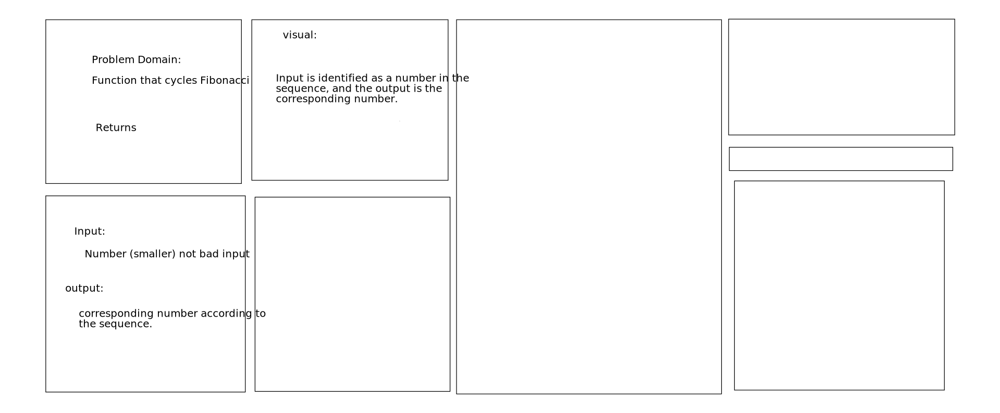

# Code Challenge: Whiteboarding Interview
Specifications
Read all of the following instructions carefully.
Today, you and a peer will take turns interviewing each other with a code challenge
The interviewer will score the candidate according to the Whiteboard Rubric
Notes can be taken in an electronic copy of the doc, or a print out of it
In either case, the completed rubric will be given to the candidate for review purposes
The candidate submits the rubric with the score they achieved as a candidate
Each interview should be timeboxed to a strict 30 minutes

Feature Tasks
As an interviewer, familiarize yourself with the Fibonacci Sequence
Ask the candidate to write a function to accepts an integer, and returns the nth number in the Fibonacci sequence.
You should be able to check their work for small values of n: if fib(n) is equal to fib(n-1) + fib(n-2).
Encourage the candidate to work quickly towards a first solution, that is either recursive or iterative (with a while or for loop)
Then ask the candidate to solve it with the other approach (eg: if they first used an iterative solution, ask for a recursive solution)
Evaluate and compare the Big-O of both solutions
The recursive solution might be as bad as O(2n)—that’s 2 to the power of n— which is so bad most laptops would take a while to solve for n larger than about 40
The iterative solution should be roughly O(n), which means a laptop could find answers for large values of n
There is also an O(1) solution, based on a mathematical formula… Not likely anyone will know this without looking it up! (Did you see the formula on the page about the sequence linked above?) If time allows, try to implement the formula with the candidate.
Avoid utilizing any of the built-in methods available to your language.

## CC=Code Challenge/Pair Programming
Sowmya Billakanti & Andre Olivier Martin

## Languages

## Solution
no solution was found because i couldn't think my way through the problem.

## Sources and credits