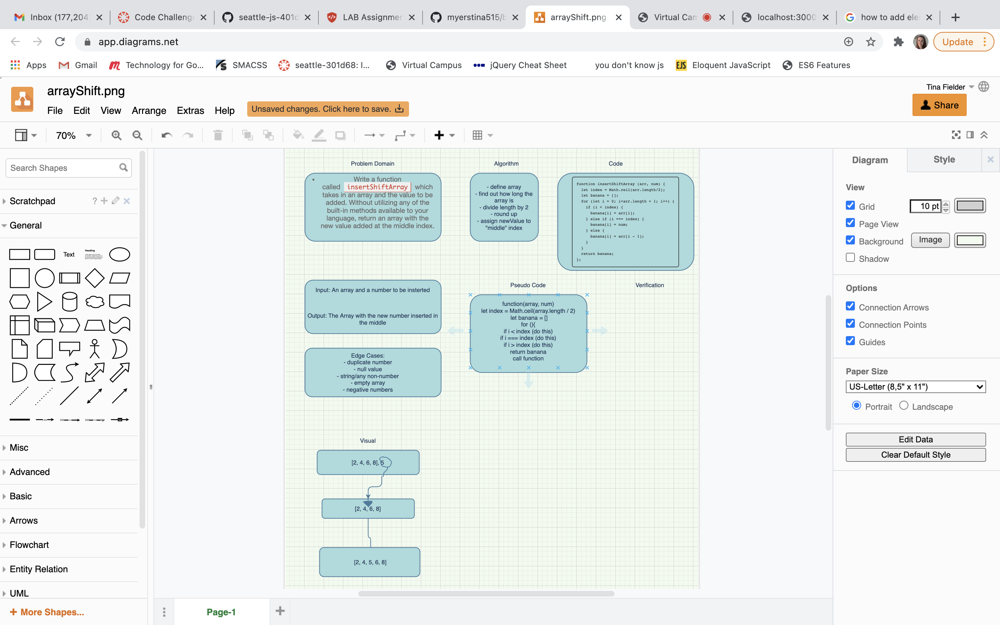

# Code Challenge: Array_Binary_Shift
 > Write a function called insertShiftArray which takes in an array and the value to be added. Without utilizing any of the built-in methods available to your language, return an array with the new value added at the middle index.

## CC=Code Challenge/Pair Programming
> Tina Meyers & Andre Olivier Martin

## Languages:
 

## Solution:

### Sources:
https://hosting.review/tutorial/javascript-add-to-array/
https://www.geeksforgeeks.org/how-to-write-a-pseudo-code/
